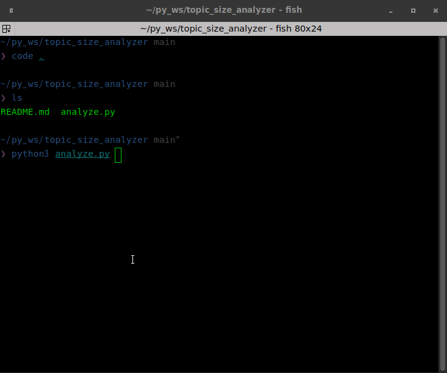

# Topic size analyzer for rosbag2

When recording with ros2 bag record -a in a ros application, e.g., autoware, an extremely large bag file may be created.
This tool can be used to identify topics with large file sizes.

## requirements

- ROS2 galactic / humble
- rosbag2
- python3

## usage

```shell
python3 analyze.py ${bag_dir} [--csv_path ${output_csv_path}] 

# then csv file will be generated in csv_path, please open csv file.
# If you don't set csv_path, csv path will be generated in current directory
```

## demo


